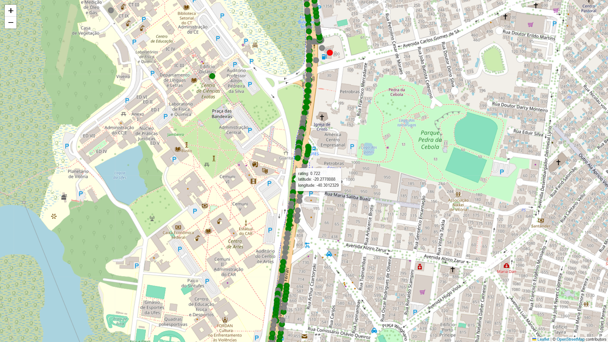

# road-surface-plotter
Project that plots collected surface quality data into a map.



Figure: Example output map with plotted surface quality points.

## How to run

Prerequisites: Python 3.8+ installed.

1. Install dependencies:

```powershell
pip install --upgrade pip
pip install -r requirements.txt
```

(If you don't want to use `requirements.txt` you can install folium directly: `pip install folium`)

3. Run the script to generate the map HTML:

```powershell
python .\main.py
```

4. Open the generated `map.html` in your default browser:

Notes:
- The script reads `with_duplicated_cols.csv` from the repository root and writes `map.html` in the same folder.
- If you prefer a different Python executable, replace `python` with the full path to the interpreter.